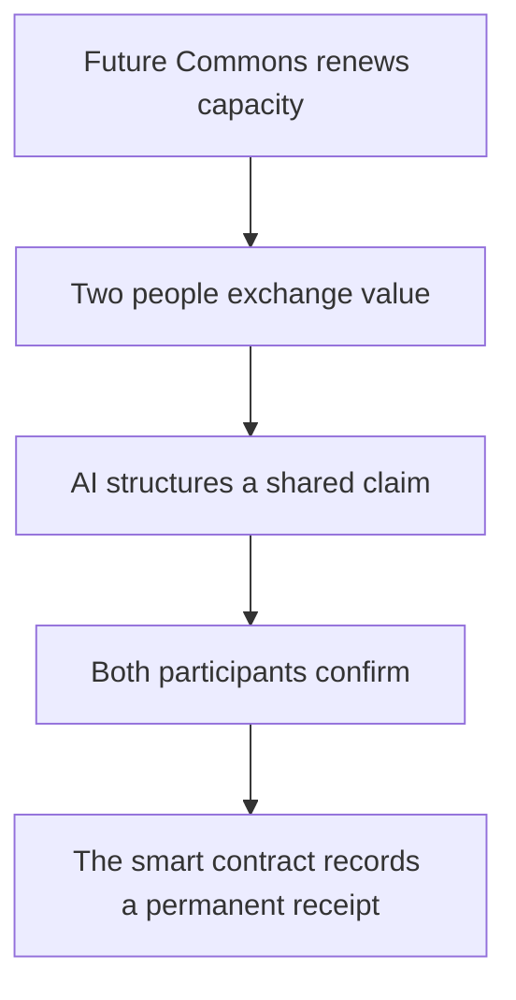

# GameOver

GameOver: human exchange credits expire each sunrise while Ethereum history endures.

GameOver is a solo ETHOnline 2026 Proof-of-Encounter experiment by Rudolf Hartwig. It asks whether an economic system can value verified participation rather than transaction size or passive token holding.

When two people exchange goods, services, knowledge or goodwill, an AI-assisted interface structures a shared statement. Both people must confirm it before Ethereum records a minimal receipt. The current prototype makes that full idea visible while clearly separating what is already functional from what still needs live integration.

## Try the prototype

Download or clone this repository, then double-click `rhart-encounter-lab.html`.

The demonstration is a standalone offline file. It needs no installation, wallet, API key or internet connection.

Try this sequence:

1. Prepare the default Pam-and-Elijah encounter.
2. Confirm it independently as both participants.
3. Anchor it to the simulated Ethereum event log.
4. Ask the chain-aware AI what occurred.
5. Advance sunrise and observe that balances reset while the receipt survives.
6. Open **Read the model** and **Inspect the contract** for the architecture and Solidity source.

## Core hypothesis

The “infinite future depository” is not implemented as a wallet containing infinite money. It is an inexhaustible protocol rule operating across time:

- Every verified participant begins each UTC day at zero.
- Receiving value moves the recipient to −1.
- Contributing value moves the contributor to +1.
- Someone already at −1 must contribute before receiving again that day.
- At the next sunrise, current balances return to zero and cannot be hoarded.
- Mutually confirmed encounter receipts remain permanently queryable.

Temporary capacity therefore decays while verified participation history accumulates.

## Encounter flow

## What currently works

- Responsive browser-based explanation and interaction flow.
- Goods, service, knowledge and goodwill encounter categories.
- Deterministic AI-like structuring of a human-readable encounter claim.
- SHA-256 evidence digest and privacy-preserving location commitment where browser support is available.
- Visual rotating encounter-code demonstration.
- Independent contributor and recipient confirmation.
- Daily +1/−1 balance movement with a −1 receiving floor.
- Sunrise reset while prior receipts remain in the ledger.
- Ledger-grounded recall showing what an eventual AI indexer should answer.
- Dependency-free Solidity 0.8.24 contract implementing the core state transition.

## What is still simulated

- Ethereum blocks and transactions in the HTML interface.
- AI inference; the browser currently uses deterministic local structuring.
- Wallet connection and transaction signing.
- One-person-one-account verification.
- Biometric device checks and rotating QR scanning.
- Persistent off-chain evidence storage and a live event indexer.

These are implementation targets, not completed integrations.

## Smart contract

`EncounterLedger.sol` contains the dependency-free Solidity prototype:

- A hackathon-only verifier allowlist represents proof of personhood.
- The contributor proposes an encounter in the first transaction.
- The recipient confirms it in a second transaction.
- Only confirmation moves the daily balances and emits `EncounterConfirmed`.
- An encounter expires if it is not confirmed during the epoch in which it was proposed.
- Lazy epoch accounting makes stale balances read as zero after sunrise.
- Only hashes and commitments are stored; raw descriptions, biometrics and exact GPS remain off-chain.

### Test in Remix

1. Open [Remix](https://remix.ethereum.org/).
2. Create `EncounterLedger.sol` and paste in the repository file.
3. Compile with Solidity 0.8.24 or a compatible 0.8.x compiler.
4. Deploy with your own account as the `verifier` constructor argument. Passing the zero address makes the deployer the verifier.
5. Call `setVerifiedHuman` for two test accounts.
6. From the contributor account, call `proposeEncounter` with the recipient and two `bytes32` test hashes.
7. From the recipient account, call `confirmEncounter` with the returned encounter ID.
8. Inspect `balanceOf`, `encounters` and the emitted `EncounterConfirmed` event.

## Built with

- HTML5 and responsive CSS
- Vanilla JavaScript
- Browser Web Crypto API
- Solidity 0.8.24
- Ethereum event and commitment patterns

No frontend framework, package manager or external runtime dependency is required for the current demonstration.

## Solo builder

**Rudolf Hellmut Hartwig** — Cape Town, South Africa

Founder, artist and maker at rhART, exploring economics, philosophy, artificial intelligence and Ethereum as a record of human participation.

## ETHOnline 2026 work disclosure

Before ETHOnline 2026, the underlying economic idea had been explored in conceptual discussions and non-code notes. No source code in this repository existed before the event.

The interactive interface, Solidity prototype, technical model, tests and repository documentation were produced during ETHOnline 2026. 

## AI assistance disclosure

ChatGPT/Codex assisted with:

- translating Rudolf’s economic premise into a bounded protocol model;
- generating and revising the HTML, CSS, JavaScript and Solidity prototype;
- preparing documentation and submission wording;
- running static and interaction-flow checks.

Rudolf originated the concept, defined the economic assumptions, directed the design choices, evaluated the outputs and is the project’s sole builder and submitter. The repository deliberately identifies simulated components rather than presenting AI-assisted work as completed live infrastructure.

## Security and privacy boundaries

- This contract is experimental and unaudited.
- Two signatures prove agreement, not objective physical truth.
- AI should remain a scribe and risk signal, not be the sole oracle of an encounter.
- Biometric material must never be written to a public blockchain.
- Exact GPS creates surveillance risk; store a salted commitment or coarse location cell.
- A public verifier allowlist is centralized and must later be replaced or strengthened.
- If encounter credits become redeemable for fiat currency or scarce assets, a funded reserve or explicit source of external value is still required.

## Repository files

| File | Purpose |
| --- | --- |
| `index.html` | GitHub Pages entry point that opens the interactive lab |
| `rhart-encounter-lab.html` | Runnable offline interface and economic explainer |
| `EncounterLedger.sol` | Solidity prototype for proposal, confirmation and daily accounting |
| `ETHGLOBAL_SUBMISSION.md` | Prepared ETHGlobal form text and submission checklist |
| `LICENSE.md` | MIT open-source licence |

## Licence

Released under the MIT Licence for the ETHOnline 2026 prototype.
